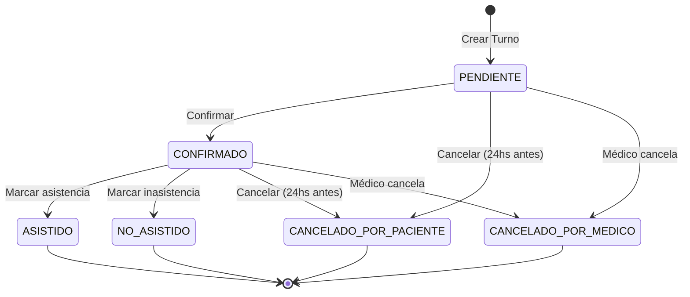

# 🏥 Sistema de Turnos Médicos - Backend API

## 📋 Descripción

Sistema completo de gestión de turnos médicos con múltiples roles, validaciones complejas, notificaciones automáticas y arquitectura escalable.

## ✨ Características Implementadas

### 👥 Roles del Sistema

#### 🧑 PACIENTE
- ✅ Registrarse / Login
- ✅ Ver especialidades disponibles
- ✅ Ver médicos por especialidad
- ✅ Consultar disponibilidad de médicos
- ✅ Reservar turno
- ✅ Cancelar turno (con validación de 24hs de anticipación)
- ✅ Ver historial de turnos

#### 👨‍⚕️ MÉDICO
- ✅ Configurar agenda (horarios laborales)
- ✅ Definir horarios de atención por día
- ✅ Bloquear días (vacaciones, feriados, etc.)
- ✅ Ver turnos asignados
- ✅ Marcar asistencia
- ✅ Marcar inasistencia
- ✅ Agregar observaciones a turnos

#### 🧑‍💼 ADMINISTRADOR
- ✅ ABM Médicos completo
- ✅ ABM Especialidades completo
- ✅ ABM Sucursales completo
- ✅ Gestionar cancelaciones
- ✅ Vista completa del sistema

---

## 🧱 Modelo de Dominio

### Entidades Principales

```
Usuario
├── Paciente
├── Médico
└── Rol (PACIENTE, MEDICO, ADMIN)

Médico
├── Especialidad
├── Sucursal
├── HorarioLaboral (múltiples por médico)
├── DiaBloqueo (bloqueos de agenda)
└── Turnos

Turno
├── Paciente
├── Médico
├── EstadoTurno
├── TipoConsulta
└── Observaciones

Notificación
└── Usuario

Auditoria
└── Usuario
```

---

## 🔄 Estados del Turno



### Estados Disponibles
- **PENDIENTE**: Turno creado, esperando confirmación
- **CONFIRMADO**: Turno confirmado por el sistema
- **CANCELADO_POR_PACIENTE**: Cancelado por el paciente (requiere 24hs anticipación)
- **CANCELADO_POR_MEDICO**: Cancelado por el médico (notifica al paciente)
- **ASISTIDO**: Paciente asistió a la consulta
- **NO_ASISTIDO**: Paciente no asistió a la consulta

---

## 🔐 Seguridad

### Tecnologías
- **JWT** (JSON Web Tokens)
- **BCrypt** para encriptación de contraseñas
- **RBAC** (Role-Based Access Control)
- **Spring Security** con filtros personalizados

### Roles y Permisos

| Endpoint | PACIENTE | MÉDICO | ADMIN |
|----------|----------|--------|-------|
| `/api/auth/**` | ✅ | ✅ | ✅ |
| `/api/pacientes/{id}/turnos` | ✅ (propio) | ❌ | ✅ |
| `/api/medicos/{id}/bloquear-dia` | ❌ | ✅ (propio) | ✅ |
| `/api/turnos/{id}/confirmar` | ❌ | ✅ | ✅ |
| `/api/turnos/{id}/marcar-asistencia` | ❌ | ✅ | ✅ |
| `/api/admin/**` | ❌ | ❌ | ✅ |

---

## 📡 Endpoints API

### 🔑 Autenticación

```http
POST   /api/auth/register     # Registrar nuevo usuario
POST   /api/auth/login        # Login y obtener JWT
```

### 🧑 Pacientes

```http
GET    /api/pacientes/{id}           # Obtener paciente
GET    /api/pacientes/{id}/turnos    # Historial de turnos
PUT    /api/pacientes/{id}           # Actualizar paciente
DELETE /api/pacientes/{id}           # Eliminar paciente
```

### 👨‍⚕️ Médicos

```http
GET    /api/medicos                      # Listar médicos
GET    /api/medicos?especialidad={id}   # Filtrar por especialidad
GET    /api/medicos/{id}                # Obtener médico
POST   /api/medicos/{id}/bloquear-dia   # Bloquear día
GET    /api/medicos/{id}/dias-bloqueados # Ver días bloqueados
DELETE /api/medicos/bloqueos/{id}       # Desbloquear día
```

### 📅 Agenda y Disponibilidad

```http
GET    /api/agenda/medico/{id}?fecha=2025-01-20              # Disponibilidad por día
GET    /api/agenda/medico/{id}?fecha=2025-01-20&fechaFin=2025-01-27  # Rango de fechas
```

### 🗓️ Turnos

```http
POST   /api/turnos                        # Crear turno
GET    /api/turnos                        # Listar todos los turnos
GET    /api/turnos/{id}                   # Obtener turno específico
PUT    /api/turnos/{id}/confirmar         # Confirmar turno
PUT    /api/turnos/{id}/marcar-asistencia # Marcar asistencia (con observaciones)
PUT    /api/turnos/{id}/marcar-inasistencia # Marcar inasistencia
DELETE /api/turnos/{id}                   # Cancelar turno
```

### 🏥 Especialidades

```http
GET    /api/especialidades    # Listar especialidades
```

### 🧑‍💼 Administración (Solo ADMIN)

```http
# Médicos
POST   /api/admin/medicos           # Crear médico
GET    /api/admin/medicos           # Listar médicos
PUT    /api/admin/medicos/{id}      # Actualizar médico
DELETE /api/admin/medicos/{id}      # Eliminar médico

# Especialidades
POST   /api/admin/especialidades    # Crear especialidad
GET    /api/admin/especialidades    # Listar especialidades
PUT    /api/admin/especialidades/{id} # Actualizar especialidad
DELETE /api/admin/especialidades/{id} # Eliminar especialidad

# Sucursales
POST   /api/admin/sucursales        # Crear sucursal
GET    /api/admin/sucursales        # Listar sucursales
GET    /api/admin/sucursales/{id}   # Obtener sucursal
PUT    /api/admin/sucursales/{id}   # Actualizar sucursal
DELETE /api/admin/sucursales/{id}   # Eliminar sucursal
```

---

## 🧠 Lógica de Negocio

### 1️⃣ Disponibilidad Real

Al consultar disponibilidad, el sistema verifica:
- ✅ Horarios laborales del médico para ese día
- ✅ Días bloqueados (vacaciones, feriados)
- ✅ Turnos ya reservados en ese horario
- ✅ Duración del turno según especialidad
- ✅ Solapamiento de horarios

### 2️⃣ Agenda Médica

Los médicos pueden configurar:
- **Días de atención**: Lunes a Domingo
- **Horario de inicio/fin**: Por cada día
- **Duración por turno**: 15, 30, 45, 60 minutos
- **Bloqueos de días**: Con motivo (vacaciones, capacitación, etc.)

### 3️⃣ Cancelaciones

#### Restricciones:
- ⏰ Paciente solo puede cancelar con **24 horas de anticipación**
- 🚫 No se puede cancelar un turno finalizado (ASISTIDO/NO_ASISTIDO)
- 📧 Notificación automática al cancelar

#### Cancelación por Médico:
- ✅ Sin restricción de tiempo
- 📧 Notifica automáticamente al paciente
- 🔓 Libera el horario para otros pacientes

### 4️⃣ Eventos Automáticos

| Evento | Acción | Implementado |
|--------|--------|--------------|
| Creación de turno | Email de confirmación | ✅ |
| 24h antes | Recordatorio automático | ✅ |
| Cancelación | Notificación inmediata | ✅ |
| Confirmación | Email de confirmación | ✅ |

**Scheduler**: Ejecuta a las 9:00 AM todos los días para enviar recordatorios.

---

## 🏗️ Arquitectura

### Estructura de Capas

```
src/main/java/com/proyecto/backend_api/
│
├── 📁 domain/              # Capa de Dominio
│   ├── model/             # Entidades JPA
│   ├── repository/        # Interfaces de repositorios
│   ├── dto/               # Request/Response DTOs
│   └── enums/             # Enumeraciones
│
├── 📁 application/         # Capa de Aplicación
│   ├── service/           # Servicios de negocio
│   └── usecase/           # Casos de uso específicos
│
├── 📁 infrastructure/      # Capa de Infraestructura
│   ├── controller/        # REST Controllers
│   ├── security/          # Configuración de seguridad
│   ├── exception/         # Manejo de excepciones
│   └── scheduler/         # Tareas programadas
│
└── 📁 config/              # Configuración
    ├── SecurityConfig     # Spring Security
    ├── JwtConfig          # JWT
    ├── EmailConfig        # Email
    └── OpenApiConfig      # Swagger/OpenAPI
```

### Patrones Implementados

- **Clean Architecture**: Separación clara de capas
- **Repository Pattern**: Abstracción de persistencia
- **Use Case Pattern**: Lógica de negocio específica
- **DTO Pattern**: Transferencia de datos segura
- **Builder Pattern**: Construcción de objetos complejos

---

## 🚀 Tecnologías

### Backend
- **Java 17**
- **Spring Boot 3.x**
- **Spring Security** (JWT)
- **Spring Data JPA**
- **Hibernate**

### Base de Datos
- **PostgreSQL** (producción)
- **H2** (desarrollo/testing)

### Documentación
- **Swagger/OpenAPI 3.0**
- Accesible en: `http://localhost:8080/swagger-ui.html`

### Testing
- **JUnit 5**
- **Mockito**
- **Spring Boot Test**

### Herramientas
- **Maven**
- **Lombok**
- **MapStruct** (mapeo de DTOs)
- **Docker** (containerización)

---

## ⚙️ Configuración

### Variables de Entorno

```properties
# Database
SPRING_DATASOURCE_URL=jdbc:postgresql://localhost:5432/turnos_medicos
SPRING_DATASOURCE_USERNAME=postgres
SPRING_DATASOURCE_PASSWORD=password

# JWT
JWT_SECRET=your-secret-key-here
JWT_EXPIRATION=86400000

# Email
SPRING_MAIL_HOST=smtp.gmail.com
SPRING_MAIL_PORT=587
SPRING_MAIL_USERNAME=your-email@gmail.com
SPRING_MAIL_PASSWORD=your-app-password
```

### Ejecutar con Docker

```bash
# Levantar base de datos
docker-compose up -d

# Ejecutar aplicación
./mvnw spring-boot:run
```

---

## 📝 Ejemplos de Uso

### 1. Registrar Paciente

```bash
POST /api/auth/register
Content-Type: application/json

{
  "email": "paciente@example.com",
  "password": "password123",
  "nombre": "Juan",
  "apellido": "Pérez",
  "telefono": "+54911234567",
  "rol": "PACIENTE",
  "documento": "12345678",
  "direccion": "Calle Falsa 123",
  "obraSocial": "OSDE",
  "numeroAfiliado": "123456789"
}
```

### 2. Login

```bash
POST /api/auth/login
Content-Type: application/json

{
  "email": "paciente@example.com",
  "password": "password123"
}

Response:
{
  "token": "eyJhbGciOiJIUzI1NiIsInR5cCI6IkpXVCJ9...",
  "tipo": "Bearer",
  "usuario": {
    "id": 1,
    "nombre": "Juan",
    "apellido": "Pérez",
    "rol": "PACIENTE"
  }
}
```

### 3. Consultar Disponibilidad

```bash
GET /api/agenda/medico/1?fecha=2025-01-20
Authorization: Bearer {token}

Response:
[
  {
    "medicoId": 1,
    "medicoNombre": "Dr. Martínez",
    "fecha": "2025-01-20",
    "horaInicio": "09:00",
    "horaFin": "09:30",
    "disponible": true
  },
  {
    "medicoId": 1,
    "medicoNombre": "Dr. Martínez",
    "fecha": "2025-01-20",
    "horaInicio": "09:30",
    "horaFin": "10:00",
    "disponible": false
  }
]
```

### 4. Crear Turno

```bash
POST /api/turnos
Authorization: Bearer {token}
Content-Type: application/json

{
  "pacienteId": 1,
  "medicoId": 1,
  "fechaHora": "2025-01-20T09:00:00",
  "tipoConsulta": "PRIMERA_VEZ",
  "sucursalId": 1
}
```

### 5. Bloquear Día (Médico)

```bash
POST /api/medicos/1/bloquear-dia
Authorization: Bearer {token}
Content-Type: application/json

{
  "fecha": "2025-02-15",
  "motivo": "Vacaciones"
}
```

---

## 🧪 Testing

```bash
# Ejecutar todos los tests
./mvnw test

# Ejecutar con cobertura
./mvnw test jacoco:report
```

---

## 📊 Mejoras Futuras

### Funcionalidades Pendientes
- [ ] Refresh Tokens
- [ ] Rate Limiting
- [ ] Reportes y analytics para administrador
- [ ] Historial médico del paciente
- [ ] Recordatorios por SMS/WhatsApp
- [ ] Videoconsulta
- [ ] Pago online de consultas
- [ ] Sistema de calificaciones

### Optimizaciones Técnicas
- [ ] Caché con Redis
- [ ] Paginación en listados
- [ ] Búsqueda avanzada con Elasticsearch
- [ ] Eventos asíncronos con RabbitMQ
- [ ] Monitoreo con Prometheus + Grafana

---

## 👥 Equipo

Desarrollado como proyecto educativo del Sistema de Turnos Médicos.

---

## 📄 Licencia

Este proyecto está bajo la licencia MIT.

---

## 🙏 Agradecimientos

- Spring Boot Team
- Comunidad de Java
- OpenAPI Initiative

---

## 📞 Contacto

Para consultas o sugerencias, contactar a través del repositorio del proyecto.

---

**Última actualización:** 27 de diciembre de 2025
